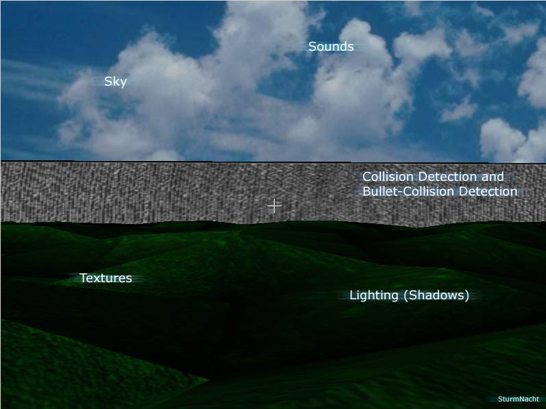



## A 3D\-Game & Engine

### Description

[Updated] This is a 3D-Engine with a Game, a sensless game tough, where u can shoot the triangles on the floor. It uses DirectX. The Engine features stuff like Very crude shadows and collision detection... It is still quite slow, and i suggest u turn of lighting when starting the program. It uses my own Lighting engine, so it is quite slow when loading. The lighting isn't realtime ;) Enjoy
 
### More Info
 

             |
---                |---
**Submitted On**   |2002-12-06 08:57:20
**By**             |[\<\<ULTIMA\>\>](https://github.com/Planet-Source-Code/PSCIndex/blob/master/ByAuthor/ultima.md)
**Level**          |Intermediate
**User Rating**    |5.0 (70 globes from 14 users)
**Compatibility**  |VB 6\.0
**Category**       |[DirectX](https://github.com/Planet-Source-Code/PSCIndex/blob/master/ByCategory/directx__1-44.md)
**World**          |[Visual Basic](https://github.com/Planet-Source-Code/PSCIndex/blob/master/ByWorld/visual-basic.md)
**Archive File**   |[A\_3D\-Game\_1509291272002\.zip](https://github.com/Planet-Source-Code/ultima-a-3d-game-engine__1-41287/archive/master.zip)

